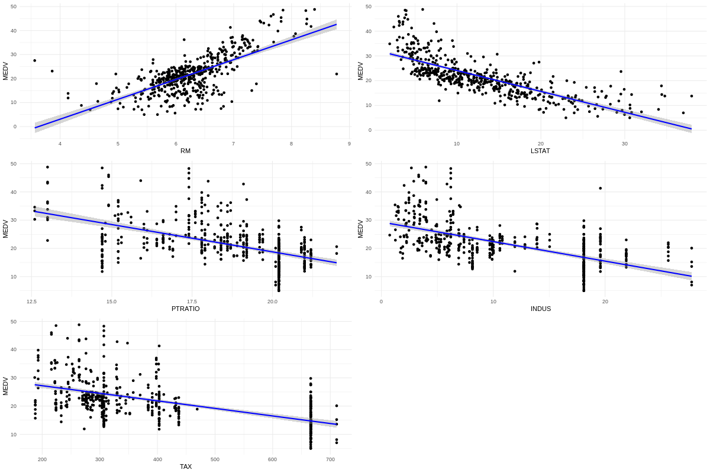
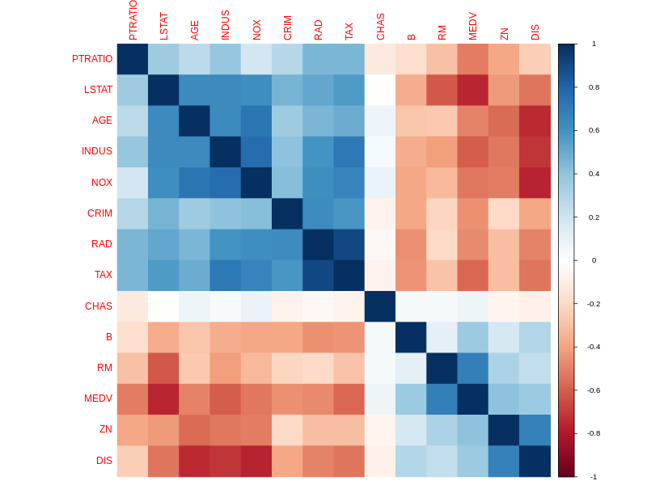
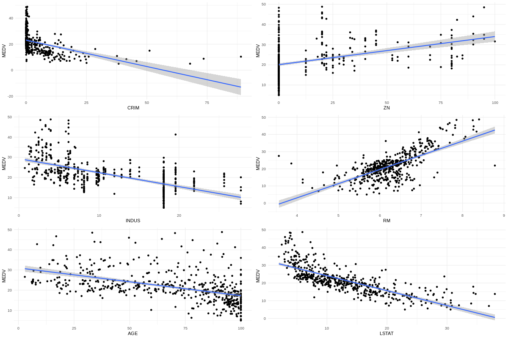

# **Analyzing the Boston Housing Dataset: Predicting Home Prices with Multivariate Data Analysis**

When it comes to understanding the factors that influence housing prices, data analysis is a powerful tool. 
In this project, I explored the **Boston Housing Dataset**, a classic dataset often used in regression analysis, 
to uncover insights into what drives the median value of owner-occupied homes. Here’s a breakdown of my approach, findings, and key takeaways.

---

## **The Dataset**
The Boston Housing Dataset contains information about 506 neighborhoods in Boston, with 14 features describing various aspects of each neighborhood. These features include:
- **CRIM**: Per capita crime rate.
- **RM**: Average number of rooms per dwelling.
- **LSTAT**: Percentage of lower-status population.
- **MEDV**: Median value of owner-occupied homes (the target variable).

The goal was to analyze the relationships between these features and **MEDV**, and ultimately build a regression model to predict housing prices.

---

## **Key Steps in the Analysis**

### **1. Data Cleaning and Exploration**
The dataset had no missing values, but I noticed that some rows had **MEDV** values set to $50,000, which seemed like outliers. 
I removed these rows to ensure the analysis wasn’t skewed.

### **2. Exploratory Data Analysis (EDA)**
I started by visualizing the relationships between **MEDV** and other features using scatter plots. 
For example, I plotted **MEDV** against **RM** (average number of rooms) and **LSTAT** (percentage of lower-status population).

From the plot, I observed a **strong positive correlation** between **RM** and **MEDV**: homes with more rooms tend to have higher values. Conversely, **LSTAT** showed a **strong negative correlation** with **MEDV**: neighborhoods with a higher percentage of lower-status populations tend to have lower home values.

---

### **3. Correlation Analysis**
To quantify these relationships, I calculated the correlation matrix and visualized it.

The analysis revealed that **RM** and **LSTAT** had the strongest correlations with **MEDV** (0.70 and -0.74, respectively). Other features like **PTRATIO** (pupil-teacher ratio) and **TAX** (property tax rate) also showed moderate correlations.

---

### **4. Regression Modeling**
I built two linear regression models to predict **MEDV**:
1. **Model 1**: Using all 13 independent variables.
2. **Model 2**: Using only the most correlated variables (**RM**, **LSTAT**, **PTRATIO**, **INDUS**, and **TAX**).

#### **Model 1: All Features**
This model achieved an **R-squared value of 0.7777**, meaning it explained about 77.8% of the variance in **MEDV**.

#### **Model 2: Selected Features**
This simplified model achieved an **R-squared value of 0.7297**, slightly lower than the first model but still robust. 
By reducing the number of features, this model is less likely to overfit and may perform better on unseen data.

---

## **Key Findings**
- **RM** and **LSTAT** are the most influential features in predicting home prices.
- Homes with more rooms (**RM**) tend to have higher values, while neighborhoods with a higher percentage of lower-status populations (**LSTAT**) tend to have lower values.
- The simplified regression model (using only 5 features) performed nearly as well as the full model, demonstrating the importance of feature selection.

---

## **What I Learned**
This project reinforced my understanding of:
- **Exploratory Data Analysis (EDA)**: Visualizing data is crucial for identifying patterns and relationships.
- **Correlation Analysis**: Understanding how features relate to the target variable helps in building better models.
- **Regression Modeling**: Balancing model complexity and performance is key to creating robust predictive models.

---

## **Next Steps**
- Explore more advanced regression techniques like **Ridge Regression** or **Lasso Regression** to handle multicollinearity.
- Test the model on unseen data to evaluate its generalization performance.
- Investigate other datasets to apply and refine these techniques further.

---

## **Try It Yourself**
If you’re interested in exploring the dataset or replicating this analysis, check out the project on my [GitHub repository](https://github.com/boakyejeff/Multivariate-Data-Analysis-Project-). Feel free to reach out if you have any questions or suggestions!

---

By sharing your project as a blog post, you not only demonstrate your technical skills but also your ability to communicate complex ideas clearly. This can make a strong impression on potential employers or collaborators. Good luck!
